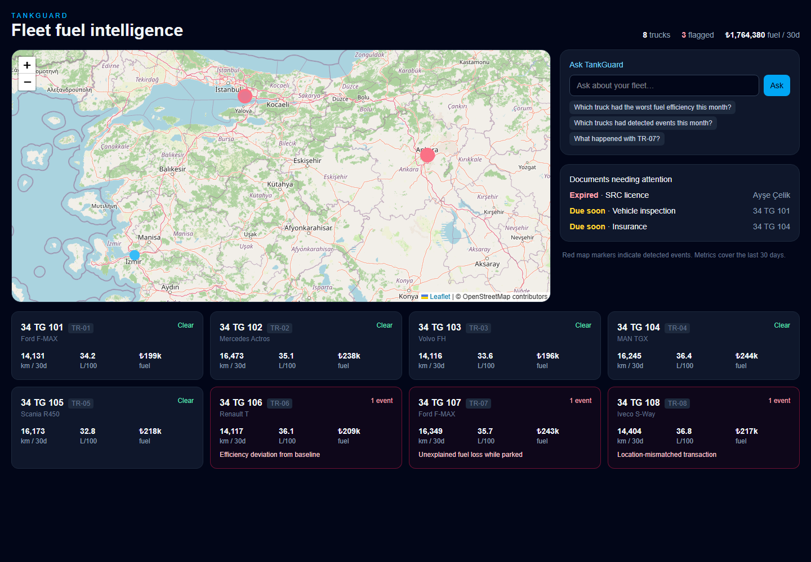
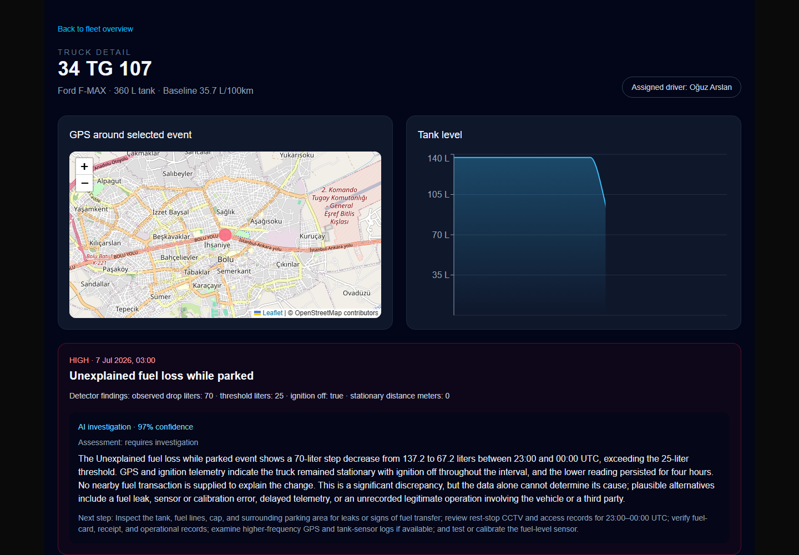

# TankGuard

Fleet fuel intelligence for trucking operators: deterministic rules cross-reference GPS and fuel telemetry to flag discrepancies; GPT-5.6 investigates each event and answers fleet questions in plain language. Demo runs on realistic seeded data.

**Live demo:** https://tankguard-ten.vercel.app





## Setup

1. Install dependencies:

   ```bash
   npm install
   ```

2. Create `.env.local` in the repository root:

   ```dotenv
   OPENAI_API_KEY=your_api_key_here
   ```

   Next.js automatically loads this file for the web app and API routes. The standalone `npm run investigate` script explicitly loads the same `.env.local` file through `dotenv`.

3. Generate deterministic source data and detect discrepancies:

   ```bash
   npm run seed
   npm run detect
   ```

4. Generate and cache GPT-5.6 verdicts, then start the app:

   ```bash
   npm run investigate
   npm run dev
   ```

Open `http://localhost:3000`, then select a truck with a detected event.

## Commands

| Command | Purpose |
| --- | --- |
| `npm run seed` | Rebuild the SQLite database and synthetic source data. |
| `npm run detect` | Run the three deterministic rules and persist event candidates. |
| `npm run investigate` | Generate/cache verdicts for all uncached candidates. |
| `npm run investigate <anomaly-id>` | Generate/cache one verdict. |
| `npm run investigate -- --truck TR-07 --refresh` | Regenerate one truck's cached verdict after a context or prompt change. |
| `npm run dev` | Run the Next.js application. |

## Product language

The application describes events, never accuses people. Assigned drivers appear only as operational context. GPT-5.6 verdicts use neutral language, consider alternatives such as sensor or timing issues, and recommend investigation steps rather than disciplinary action.

## How Codex and GPT-5.6 were used

### Built with Codex

TankGuard was built through a spec-driven workflow: `PROJECT_SPEC.md` defined the product, Codex proposed each milestone's design, implementation followed explicit approval, and each stage ended with data and build verification.

- Codex proposed the SQLite schema and detection design, then incorporated the review refinements: explicit anomaly windows, polymorphic document ownership, and the benign `no_issue_identified` verdict classification.
- It caught a seed-data flaw that could have created Rule B false positives, then updated normal refuels to use location-appropriate stations rather than only plausible coordinates.
- It kept verdicts truthful: when an API key was unavailable, it did not fabricate an investigation and instead preserved the cache/setup fallback.
- It diagnosed the React Strict Mode race that left automatic investigations stuck on their loading state, then made both the client update and the SQLite-backed investigation lock idempotent.

### GPT-5.6 at runtime

GPT-5.6 powers two runtime workflows. The anomaly verdict pipeline uses the Responses API with structured outputs and a compact evidence bundle of telemetry, transactions, truck context, and deterministic findings. Its system prompt requires neutral, non-accusatory language, alternative explanations, and recommended investigation steps.

The dashboard query box uses GPT-5.6 function calling over three read-only tools: `get_fleet_stats`, `get_truck_detail`, and `list_anomalies`. The model never receives direct SQL access, and answers in the language of the question. In evaluation runs, its confidence calibration tracked evidence strength (approximately 0.99, 0.96, and 0.90), rather than treating every detected event as equally certain.

## Data note

All data is synthetic. Seed timestamps model Turkey local time (UTC+3) and are stored as ISO 8601 UTC strings in SQLite.

## Deploy to Vercel

The repository includes `data/tankguard.db`, pre-seeded and pre-investigated with all three verdicts. It is deliberately committed for the demo: Vercel's serverless filesystem is read-only at runtime, so cached verdicts render without a write or a live investigation call.

1. Commit the included database along with the application changes, then import the repository into Vercel (or run `vercel` from the repository root).
2. Select the Next.js framework preset. Use the default install command and `npm run build`; no custom build command is required.
3. Add `OPENAI_API_KEY` in **Project Settings → Environment Variables** for Production and Preview. The pre-cached anomaly cards work without it, but the dashboard's natural-language query feature requires it.
4. Deploy. `next.config.ts` explicitly traces `data/tankguard.db` into each server-rendered route and API function.

Do not run `npm run seed`, `npm run detect`, or `npm run investigate` in the Vercel build command: they mutate the SQLite database. Regenerate and investigate the database locally, then commit the updated `data/tankguard.db` before a new deployment.

## Production notes

This is a hackathon build, deliberately simplified for evaluation: SQLite ships with the deployment (verdicts are pre-cached, so the live instance is effectively read-only), detection runs as batch scripts, and there is no authentication or multi-tenancy. A production deployment would separate these concerns: a hosted database such as Postgres for fleet-scale telemetry, detection as a scheduled job triggered on data ingestion with investigation following automatically, streamed GPS and fuel ingestion instead of seeded data, and per-operator authentication. The detection rules, evidence bundling, and verdict pipeline are architected to carry over unchanged.
